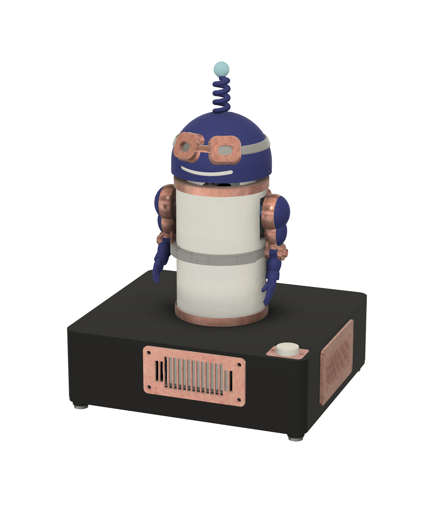

# BlooglyBlob

**A 3D-printable AI companion powered by Raspberry Pi and the OpenAI API.**

Press the button to start a voice conversation. BlooglyBlob talks back, lights up,
moves his head and arms, and can dance to music. You build the character from
printed parts and purchased electronics, then install the Python application on
the Pi.

This repository contains the application, editable CAD, STL files, Bambu Studio
print projects, and illustrated assembly instructions.

**[Open the build guide →](https://demartinistudios.github.io/blooglyblob/)**

## Build your own

Start with the [build guide](https://demartinistudios.github.io/blooglyblob/).
It brings the parts list, print downloads, assembly drawings, wiring, Pi setup
and software commands together in one numbered sequence. You can read it and
download the print files without cloning this repository.

- **[Parts and supplies](https://demartinistudios.github.io/blooglyblob/#parts):** what to buy, quantities and tools.
- **[Print the parts](https://demartinistudios.github.io/blooglyblob/#step-print-plates):** Bambu Studio projects, raw STLs, plate layouts and print settings.
- **[Set up the Raspberry Pi](docs/software/setup.md):** Raspberry Pi Imager, Wi-Fi, credentials and installation commands. This is also covered in the guide.

The build uses a Raspberry Pi 3 Model A+, USB audio, speakers, NeoPixel LEDs and
servos. Expect 3D printing, soldering and some terminal commands. You'll need a
computer for setup, an internet connection and your own OpenAI API key with API
billing enabled. Conversations use cloud AI; API usage is billed separately from
a ChatGPT subscription. See the guide's parts list for the complete specifications.

**Project status:** this is a working development project, with physical assembly
and full-system validation still in progress. Review the
[current limitations](docs/release/publication-inventory.md#readiness-and-validation-scope)
before buying or printing parts.

## Using or changing the software

One Python application runs on the Pi and controls conversations, audio, lights
and movement. The installer sets it up as a service so it starts when the Pi boots;
the button starts a conversation.

- [Setup](docs/software/setup.md) — install and configure the application.
- [Maintenance](docs/software/maintenance.md) — update, inspect logs and troubleshoot.
- [Architecture](docs/software/architecture.md) — how the application and OpenAI connections work.
- [Contributing](CONTRIBUTING.md) — development setup, tests and contribution workflow.

Run `make help` from a checkout to see the available commands. Follow the setup
guide before running commands against a Pi.

## Find your way around the repository

| Location | What's there |
| --- | --- |
| [`blooglyblob/`](blooglyblob/) | Python application and device control |
| [`hardware/cad/`](hardware/cad/CURRENT-DESIGN.md) | Current editable CAD and exported geometry |
| [`hardware/printing/`](hardware/printing/current/README.md) | Bambu Studio projects and print guidance |
| [`hardware/build-guide/`](hardware/build-guide/README.md) | Guide source and local preview instructions |
| [`docs/software/`](docs/software/) | Setup, maintenance and software architecture |
| [`tests/`](tests/) | Automated software tests |

Open the full assembly as [Fusion (.f3d)](hardware/cad/current/assembly.f3d) or
[STEP AP214 (.step)](hardware/cad/current/assembly.step) in other CAD applications.
The STEP includes hidden reference and test geometry; see the
[CAD notes](hardware/cad/CURRENT-NOTES.md#portable-assembly).

For hardware or guide contributions, read the [hardware workflow](hardware/README.md).

## Safety and license

Build and use at your own risk. No safety or performance guarantees are made.
You are responsible for assembly, testing and use. Children must work with and
use the robot under direct adult supervision. The hands use small, strong
magnets that are dangerous if swallowed, and the microphone sends speech to
OpenAI under your API account. Read the
[safety and responsibility notice](hardware/SAFETY.md) before starting.
BlooglyBlob is not affiliated with or endorsed by OpenAI or any manufacturer
named here.

Original software, hardware designs and build materials are [MIT licensed](LICENSE).
See [license scope](LICENSING.md) for third-party exclusions and separate audio terms.
